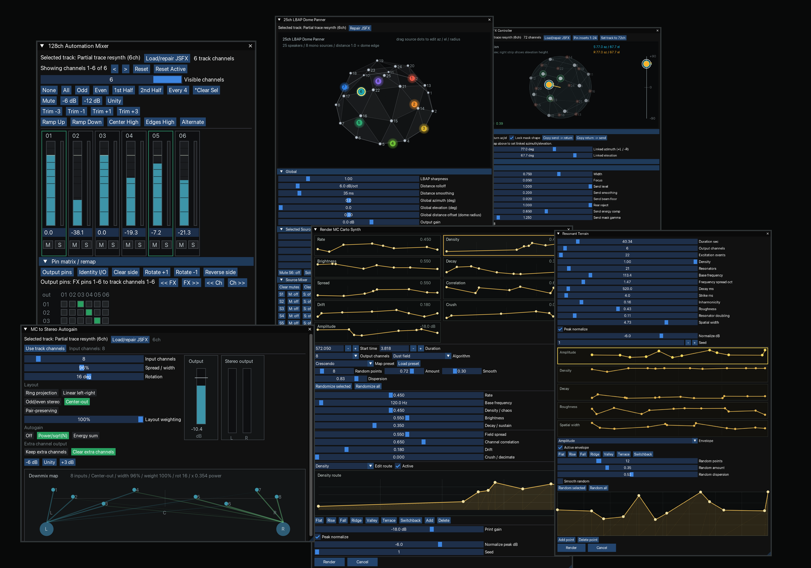

# s3g-mc

s3g-mc is a collection of REAPER tools for multichannel composition, spatial audio, offline sound transformation, and procedural synthesis.

It includes Lua actions, ReaImGui controllers, and JSFX for channel editing, automation, fold-down monitoring, dome panning, 3OA send/return routing, and render-based multichannel processes.

Many of these tools are inspired by or extend existing computer music practices, with references mentioned in the documentation where they are useful.

## Start Here

- [Installation](installation.md)
- [Dependencies](dependencies.md)
- [Tools](tools.md)
- [Workflows](workflows.md)

## Highlights

- common-layout panning plus 12ch, 17ch, and 25ch panners for RISD SRST arrays
- 3OAFX ambisonic send/return workflow for 24-channel effect inserts
- track-level automation mixer for up to 128 channels, with plugin pin control
- multichannel workflow helpers for item transforms, track routing, and stems
- Offline spectral, convolution, and resynthesis processes
- Multichannel texture and montage actions 
- Procedural synth engines rendered offline from controller actions

<figure>
  
  <figcaption>Controllers and render tools from the s3g-mc package.</figcaption>
</figure>

## License

Zero-Clause BSD. See the package
<a href="https://github.com/s3g/s3g-mc?tab=License-1-ov-file" target="_blank" rel="noopener noreferrer">LICENSE</a>.

Attribution is appreciated for software development, publications, research,
teaching materials, and projects that build on or adapt this package. See
<a href="https://github.com/s3g/s3g-mc/blob/main/CITATION.cff" target="_blank" rel="noopener noreferrer">CITATION.cff</a>.

Development assistance: OpenAI Codex.
