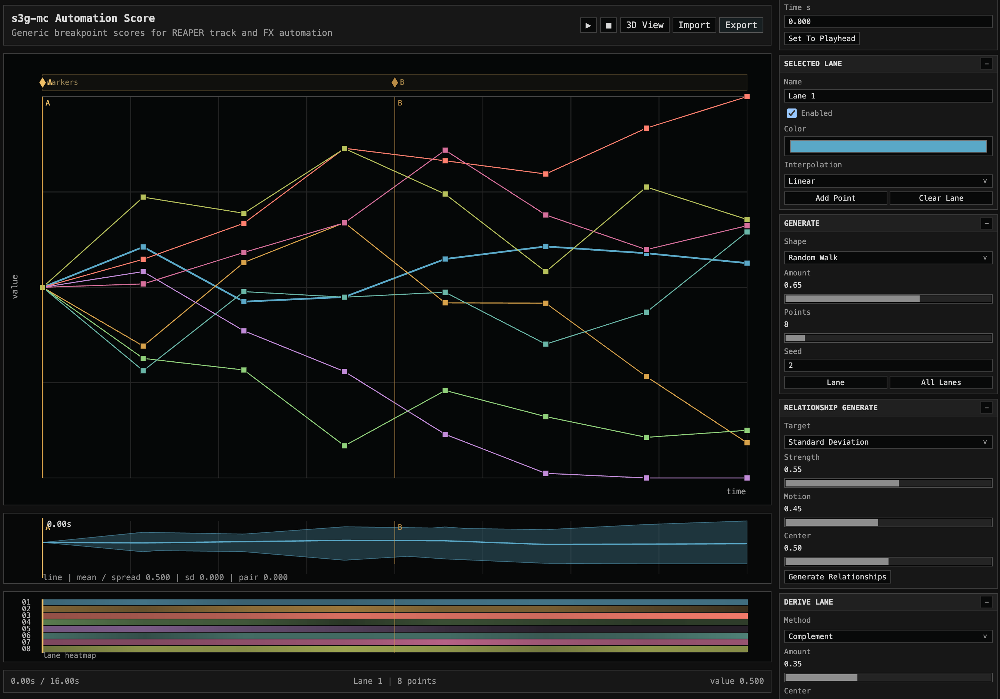

# Automation Score

  <button class="utility-screenshot-button" type="button" data-lightbox-image="assets/images/utilities/AutomationScore.png" aria-label="Open Automation Score screenshot">
    
  </button>

[Open Automation Score](utilities/automation-score-designer/){:target="_blank" rel="noopener noreferrer" .utility-link}

## Overview

Automation Score is a browser-based editor for generic breakpoint
lanes. It is useful when several automation curves need to be composed together
before being assigned to REAPER tracks or effect parameters.

The lane names are intentionally generic. The JSON stores normalized `0..1`
values, so the same field can later target track volume, an FX parameter range,
or another mapping added in a future loader.

Section markers can be added to describe the form of the score. These are
stored in the JSON and can be written as real REAPER project markers by the
loader.

## Export

Use the breakpoint canvas to add, move, and shape lanes. The generator panel can
fill one lane or all lanes with ramps, waves, gates, random walks, mirrored
pairs, and staggered shapes. Relationship tools can generate coordinated lane
behavior, and derived lanes can be made from the selected lane by complement,
inverse, lag, offset, smoothing, gates, or seeded variation. Export writes a
JSON file containing editable breakpoints, section markers, and sampled points
at the chosen point rate.

## Loading In REAPER

Run `Load Automation Score JSON` with one or more destination tracks selected.
The loader opens an ImGui assignment window where each score lane can be mapped
to a selected track's volume envelope, to an FX parameter envelope, or skipped.
The write mode can append the score at the chosen start time, or replace
existing envelope points inside the score range before writing.

For track volume, lane values are mapped through a dB range before REAPER
envelope points are written. The default range is `-48 dB` to `0 dB`, which
usually gives a visible and audible envelope shape.

For FX parameters, lane values are mapped through a normalized parameter range.
The assignment table lists FX and parameter names from the selected track.

The loader includes automatic assignment buttons for volume across selected
tracks and sequential FX parameters, but the per-lane table can be edited before
writing.

If the JSON contains section markers, the loader can also write them as REAPER
project markers at the corresponding positions within the imported score range.

## Max Bridge

The optional Max bridge in `Scripts/s3g-mc/utilities/automation-score-max-bridge`
reads the same Automation Score JSON. Open `Automation Score Player.maxpat`,
drop a JSON export onto the patch, then use the playback controls to output
interpolated lane values, section changes, and timing metadata at control rate.

The V8 player can output generic lane messages, normalized value messages, or
MIDI-CC-style `0..127` values. Print gates are closed by default so the patch can
run without filling the Max console.
