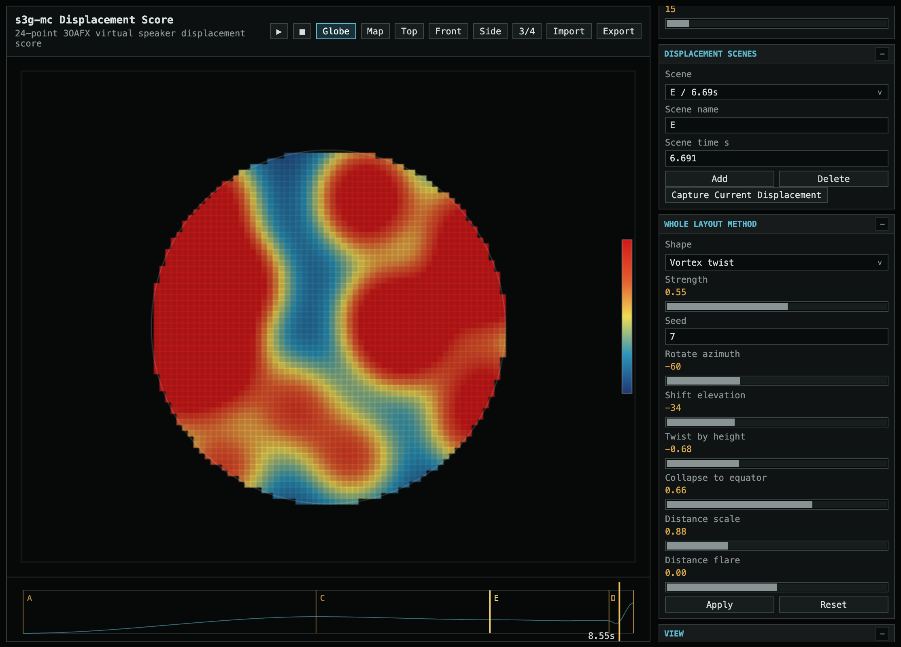

# Displacement Score

<div class="utility-screenshot">
  <button class="utility-screenshot-button" type="button" data-lightbox-image="assets/images/utilities/DisplacementScore.png" aria-label="Open Displacement Score screenshot">
    
  </button>
</div>

[Open Displacement Score](utilities/displacement-score/){:target="_blank" rel="noopener noreferrer" .utility-link}

## Overview

Displacement Score designs a geometry transform for the 24-point virtual
speaker layer used by 3OAFX processes. The browser view shows the original
directions, target directions, a polygon mesh, and blended output positions.
Displacement is organized as named scenes on a timeline. Each scene stores a
whole-layout transform generated from the method controls, and playback
interpolates between those scenes. Method controls include preset shapes plus an
`AED transform` mode that leaves the original 24-point layout intact except for
the AED and distance controls: azimuth rotation, elevation shift, height-based
twist, collapse toward the equator, distance scaling, and distance flare. The
polygon follows the active geometry, so the surface itself shows how the
24-point virtual speaker layout is being bent or folded.

Use `Globe` for the camera-based 3D view or `Map` for a flattened
Peters-style equal-area projection. Shift-drag the globe view to rotate the
camera. Use the mouse wheel to zoom the globe view.

The heatmap view colors the projected sphere as a virtual-speaker radiation
field. Each current point is hot at its center and falls away through warm and
cool regions. Cool areas show parts of the sphere with less nearby point
influence. Several color scales are available, including thermal, classic
cold-hot, inferno, viridis, magma, and greyscale. `Show points` can be turned
off when the heatmap or polygon view needs to be read without point labels and
markers.

## 3OAFX Use

The intended insertion point is after a 3OAFX process decodes ambisonic audio to
the 24-point direction layer and before that layer is re-encoded to ACN/SN3D.
This makes the displacement score a spatial transform for the intermediate
virtual speaker field rather than a replacement for ambisonic encoding.

The browser utility does not render audio by itself. Its version 1 JSON export
can be loaded directly by **s3g 3OAFX Displacement** in the related
[`s3g-dsp`](https://github.com/s3g/s3g-dsp) CLAP collection. The plugin performs
the 24-point decode, score playback, displaced re-encode, and selectable gain
or physical distance interpretation inside a 16-channel 3OA insert. Its Free
clock advances at an internal rate with Loop or Palindrome traversal. Sync
derives score position directly from the host beat timeline and selected beat
length, so transport starts, seeks, and project recalls remain time aligned.

## Time Layer

The time layer stores normalized 0..1 scene positions. Offline renderers can
scale this to the selected media item or render duration, so the same score can
expand across short or long processes. The export includes scene times and
sampled geometry frames for the moving 24-point layout. The first timeline
position is pinned to the original 24-point layout.

## Max Bridge

The optional Max bridge in
`Scripts/s3g-mc/utilities/displacement-score-jitter-bridge` reads the exported
JSON and displays the stored 24-point geometry timeline in Max. It draws the
source layout, displaced points, polygon lines, and a separate thermal heatmap
matrix. The heatmap uses the same projected-map energy model as the browser
utility. The flattened map view uses the same aspect ratio as the heatmap,
while the sphere view keeps the geometry in 3D space.

The bridge is for display, monitoring, and translation to Max patching
workflows. It does not edit or regenerate the displacement score.

## Export

Exported JSON stores:

```text
source 24-point geometry
scene names
scene target geometries
polygon mesh edges
resolved blended geometry
displacement amount
azimuth/elevation/radius scale
whole-layout AED transform settings
point visibility setting
heatmap visualization setting
heatmap color scale
radius normalization setting
time layer scene positions
time-resolved geometry frames
```

The format is `s3g-mc-displacement-score`.
