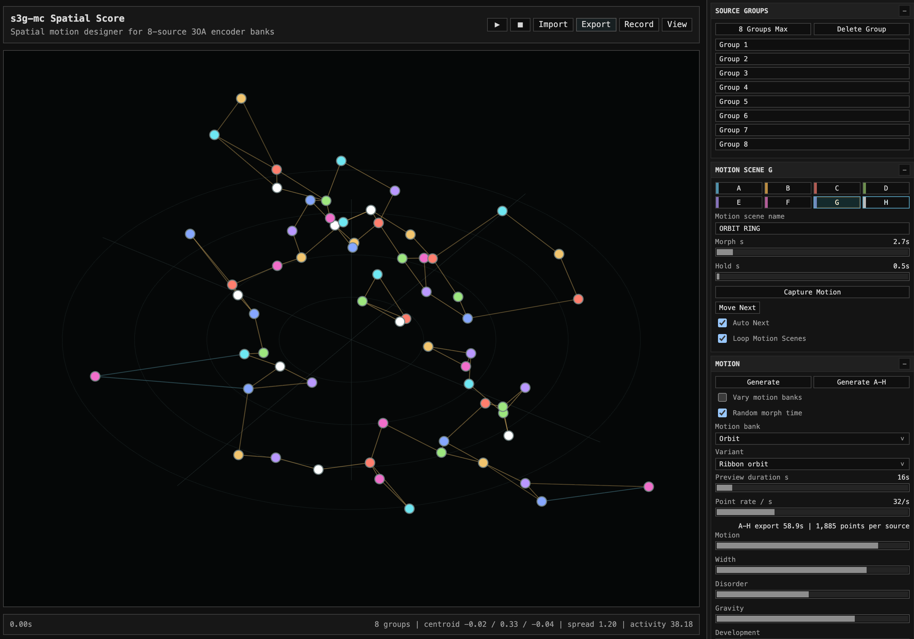

# Spatial Score

  <button class="utility-screenshot-button" type="button" data-lightbox-image="assets/images/utilities/SpatialScore.png" aria-label="Open Spatial Score screenshot">
    
  </button>

## Open Tool

[Open Spatial Score](utilities/spatial-score/){:target="_blank" rel="noopener noreferrer" .utility-link}

## Purpose

Spatial Score is a browser-based spatial motion designer for banked 8-source
third-order ambisonic motion. It is meant for composing motion first, then
writing that motion into REAPER as editable automation.

## Groups And Scenes

Each group contains up to eight sources. Up to eight groups can be used, giving
a practical target of 64 source points. Groups share the selected motion bank
and scene structure but can be offset so their points do not simply overlap.

Motion scenes store the generated source state, hold time, morph time, and
scene name. `Auto Next` advances through the scenes in order during preview.
`Generate A-H` creates a full scene set and can vary hold/morph timing.

## Motion Rules

Motion banks provide families of movement such as orbit, weave, lattice, frame,
trace, pulse, suspend, leap, field, molec, fluid, forsy, flock, eco, contact,
march, procession, xenak, cardew, path, scatter, and physics. The physics bank
adapts the older Max physics macro idea into deterministic scene behaviors such
as calm, swarm, bounce, orbit, tether, drift, vortex, and well. Variants change
the local behavior within a bank.

Variant names change with the selected motion bank. They keep the same stored
keys for JSON compatibility, but the visible names and internal profile nudges
are bank aware, so variants steer each bank toward a more specific movement
style.

For the physics bank, `Attract`, `Repel`, `Bounce`, `Collision`, `Damping`, and
`Turbulence` act inside the motion generator. Physics variants also shape these
forces. `Arc sluice` adds a multi-arc boundary with moving gaps, using the same
collision and bounce controls. `Analysis influence` is a separate global layer,
so it is usually clearest to audition physics motion with analysis influence low
or off, then add analysis only when a scene needs additional centroid or spread
control.

`Generate Motion` creates a new seeded variant for the active scene. Captured
motion can then be held, morphed into the next scene, and exported as part of a
banked motion score.

## Preview

The main view previews point position, path preview, optional centroid display,
neighbor-link analysis, and camera views. Top, side, and 3/4 views are useful
for checking whether the spatial behavior is clear before exporting.

The analysis layer can operate across all groups or only the active group.
Neighbor links draw local constellations between nearby points rather than
connecting every point to every other point.

## REAPER Export

Exported JSON can be loaded in REAPER with `Load Spatial Score JSON`. The loader
creates encoder tracks and writes source motion as automation for `s3g 8ch 3OA
Object Encoder`.

The browser utility is the design surface; REAPER remains the place where the
automation is placed, edited against media, and rendered.

## Browser Link

After loading a Spatial Score JSON in REAPER, run `Spatial Score Browser Link` to reopen the
same JSON in the browser and follow REAPER transport. The link starts a local
browser view, writes a small playhead file while the ReaScript window is open,
and lets the Spatial Score visual act as a large monitor for the automation already
written into REAPER.

## Max Bridge

The optional Max bridge in `Scripts/s3g-mc/utilities/spatial-score-max-bridge` reads
exported Spatial Score JSON directly with a V8 script. It plays back the exported
automation arrays at control rate. In ICST mode it outputs AmbiMonitor point
messages in the format `aed index azimuth elevation distance`.

This keeps Spatial Score JSON as the source format and avoids converting continuous
motion into ICST snapshot XML. The bridge is a translation layer: adapt its
generic source-message outlet if another Max-based monitoring patch needs
group, source, or gain data.
